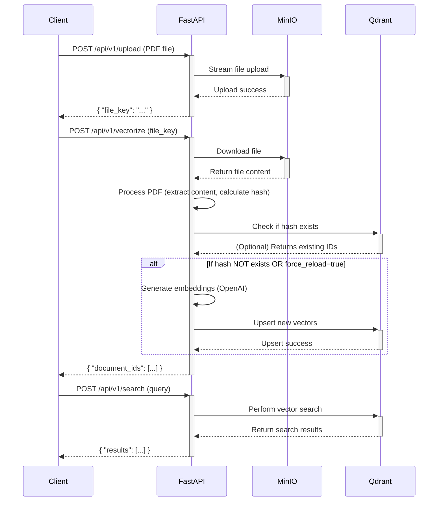

# PDF Content Extraction and Vectorization Microservice

This project provides a production-ready FastAPI microservice for extracting text, tables, and images from PDF documents, generating vector embeddings, and storing them in a Qdrant vector database. It supports Persian language OCR and is built with a clean, modular, and asynchronous architecture.

## Table of Contents

- [Architectural Overview](#architectural-overview)
- [Features](#features)
- [Project Structure](#project-structure)
- [Getting Started](#getting-started)
  - [Prerequisites](#prerequisites)
  - [Setup Instructions](#setup-instructions)
- [API Usage](#api-usage)
  - [1. Upload a PDF](#1-upload-a-pdf)
  - [2. Vectorize the PDF](#2-vectorize-the-pdf)
  - [3. Search for Content](#3-search-for-content)
- [Future Improvements](#future-improvements)

---

## Architectural Overview

The application is designed following Clean Architecture principles, ensuring a separation of concerns and making the system modular and maintainable.

- **FastAPI Application (`app`)**: The core web application that exposes the REST API.
- **Asynchronous Services**: All I/O-bound operations (file storage, database queries, embedding generation) are fully asynchronous to maximize performance.
- **Docker Compose**: The entire stack (FastAPI app, Qdrant, MinIO) is orchestrated with Docker Compose for easy setup and deployment.
- **MinIO**: An S3-compatible object storage used to persist uploaded PDF files.
- **Qdrant**: A high-performance vector database used to store the embeddings and associated metadata.
- **LangChain & `unstructured`**: Utilized for the document processing pipeline, including loading PDFs and generating embeddings.

### Data Flow Diagram



### Workflow Details

The workflow is a three-step process:
1.  **Upload**: The client uploads a PDF to the `/api/v1/upload` endpoint. The file is streamed directly to MinIO, and a unique `file_key` is returned.
2.  **Vectorize**: The client sends the `file_key` to the `/api/v1/vectorize` endpoint.
    - The service downloads the PDF from MinIO to a temporary local file.
    - It calculates the file's SHA256 hash and checks Qdrant to see if the document has already been processed.
    - If the hash is new (or if `force_reload` is true), it extracts content, generates embeddings, and upserts the vectors and metadata into Qdrant.
    - The temporary file is deleted after processing.
3.  **Search**: The client sends a query to the `/api/v1/search` endpoint. The service converts the query into a vector and performs a similarity search in Qdrant to retrieve the most relevant document chunks.

---

## Features

- **Asynchronous API**: Built with FastAPI for high performance.
- **Modular Design**: Services for storage, PDF processing, and vector DB interactions are decoupled.
- **PDF Content Extraction**: Extracts text, tables, and images using `unstructured`.
- **Persian Language Support**: Configured to perform OCR on Persian text (`fas`).
- **Duplicate Prevention**: Calculates a SHA256 hash to prevent reprocessing the same document.
- **Vector Embeddings**: Generates embeddings using OpenAI-compatible models (e.g., `text-embedding-3-small`).
- **Structured Metadata**: Stores rich metadata with each vector, including page number, section, and related images.
- **Containerized**: Fully containerized with Docker and orchestrated with Docker Compose.

---

## Project Structure

```
├── app/
│   ├── api/              # API endpoints (routers)
│   ├── core/             # Configuration and settings
│   ├── models/           # Pydantic schemas
│   ├── processing/       # PDF processing logic
│   ├── storage/          # Asynchronous storage service (MinIO)
│   ├── vector_db/        # Asynchronous vector DB service (Qdrant)
│   └── main.py           # FastAPI application entrypoint
├── .env.example          # Example environment variables
├── requirements.txt      # Python dependencies
├── Dockerfile            # Multi-stage Dockerfile for the app
└── docker-compose.yaml   # Docker Compose for the full stack
```

---

## Getting Started

### Prerequisites

- [Docker](https://docs.docker.com/get-docker/)
- [Docker Compose](https://docs.docker.com/compose/install/)
- An OpenAI-compatible API key (e.g., from [Avalai](https://avalai.ir/))

### Setup Instructions

1.  **Clone the repository:**
    ```bash
    git clone <repository-url>
    cd <repository-directory>
    ```

2.  **Configure environment variables:**
    -   Copy the example `.env` file:
        ```bash
        cp .env.example .env
        ```
    -   Edit the `.env` file and add your `OPENAI_API_KEY`:
        ```
        OPENAI_API_KEY="YOUR_AVALAI_API_KEY_HERE"
        ```

3.  **Build and run the services:**
    -   Start the entire stack using Docker Compose:
        ```bash
        docker-compose up --build -d
        ```
    -   This command will build the FastAPI image, pull the Qdrant and MinIO images, and start all the services. The application will be available at `http://localhost:8000`.

4.  **Verify the services are running:**
    -   **API Health Check**: `curl http://localhost:8000/`
    -   **API Docs**: `http://localhost:8000/docs`
    -   **MinIO Console**: `http://localhost:9001`
    -   **Qdrant Console**: `http://localhost:6333/dashboard`

---

## API Usage

### 1. Upload a PDF

Upload a PDF file to the `/upload` endpoint to receive a `file_key`.

**Request:**
```bash
curl -X 'POST' \
  'http://localhost:8000/api/v1/upload' \
  -H 'accept: application/json' \
  -H 'Content-Type: multipart/form-data' \
  -F 'file=@/path/to/your/document.pdf'
```

**Successful Response (200 OK):**
```json
{
  "status": "success",
  "message": "File uploaded successfully.",
  "file_key": "xxxxxxxx-xxxx-xxxx-xxxx-xxxxxxxxxxxx.pdf"
}
```

### 2. Vectorize the PDF

Use the `file_key` from the upload step to trigger the vectorization process. You can also force the system to re-process a document that already exists.

**Request (using `file_key`):**
```bash
curl -X 'POST' \
  'http://localhost:8000/api/v1/vectorize' \
  -H 'accept: application/json' \
  -H 'Content-Type: application/json' \
  -d '{
    "file_key": "xxxxxxxx-xxxx-xxxx-xxxx-xxxxxxxxxxxx.pdf",
    "force_reload": false
  }'
```

**Successful Response (200 OK):**
```json
{
  "status": "success",
  "message": "Successfully processed and vectorized.",
  "document_ids": [
    "xxxxxxxx-xxxx-xxxx-xxxx-xxxxxxxxxxxx",
    ...
  ],
  "file_hash": "abc123..."
}
```

### 3. Search for Content

Perform a semantic search for a query and optionally filter by a specific document hash.

**Request:**
```bash
curl -X 'POST' \
  'http://localhost:8000/api/v1/search' \
  -H 'accept: application/json' \
  -H 'Content-Type: application/json' \
  -d '{
    "query": "What are the main findings?",
    "limit": 5,
    "file_hash": "abc123..."
  }'
```

**Successful Response (200 OK):**
```json
{
  "status": "success",
  "results": [
    {
      "score": 0.89,
      "text": "The main findings indicate a positive correlation...",
      "page": 4,
      "section": "Conclusion",
      "content_type": "text",
      "metadata": { ... }
    }
  ]
}
```

---

## Future Improvements

-   **Advanced Section Detection**: Implement a more sophisticated section detection model (e.g., a fine-tuned NLP model) instead of the current heuristic-based approach.
-   **Positional Relationship Linking**: Analyze the bounding box coordinates of extracted elements to establish more precise relationships between text, tables, and images.
-   **Multi-Modal Embeddings**: Instead of just using text embeddings for images (captions/OCR), use a multi-modal model like CLIP to generate true image embeddings.
-   **Distributed Task Queue**: For very large files or high-volume processing, integrate a task queue like Celery to handle the vectorization process asynchronously in the background.
